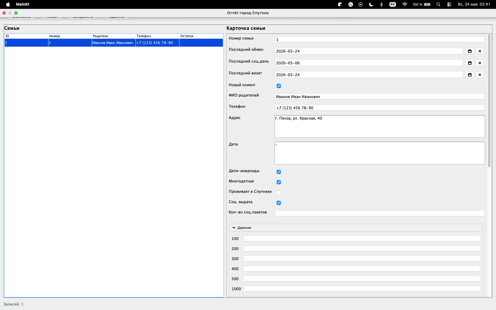

# Dobriy Shkaf Application

Проект <code>Dobriy Shkaf Application</code> представляет собой монорепозиторий и собранное
десктоп приложение, созданное для некоммерческой организации "Добрый Шкаф" в рамках выполнения студенческого
социального заказа.

## Документация

[Открыть интерактивную документацию](https://1nteractme.github.io/DobriyShkafApp/)

На странице можно ознакомиться с технической, пользовательской документацией и разделом обновлений.